<p align="center">
  
</p>

<h1 align="center">SafeHer Circle</h1>

<p align="center">
  An anonymous support board, a neighbour-to-neighbour donation exchange, an emergency alarm,<br>
  and a directory of places to get help — under a pseudonym that is never your name.
</p>

<p align="center">
  <em>Final-year project · Java 21 · Spring Boot 4 · React 19 · PostgreSQL 18 · FastAPI</em>
</p>

---

## Demo

📹 **[Watch the walkthrough](docs/demo.mp4)** — the full application, running locally.

This project is not deployed. It runs on a local machine, and the video is the
intended way to see it working. Setup instructions are below if you would rather
run it yourself.

---

## Why

Existing tools solve one piece each. Safety apps raise alerts but have no
community. Forums offer support but no way to actually reach anyone. Helpline
lists exist but are hard to find at the moment you need one. Donation platforms
move money but not the pack of pads your neighbour has spare.

This puts them together, with location awareness so help comes from nearby, and
without attaching a real name to anything published.

---

## Screenshots

| The board, signed out | A post and its replies |
|---|---|
| 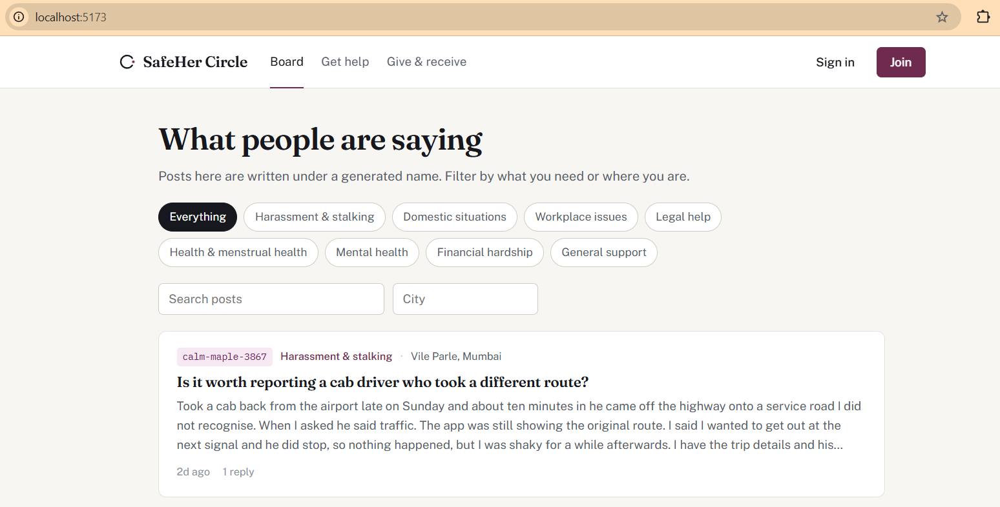 | 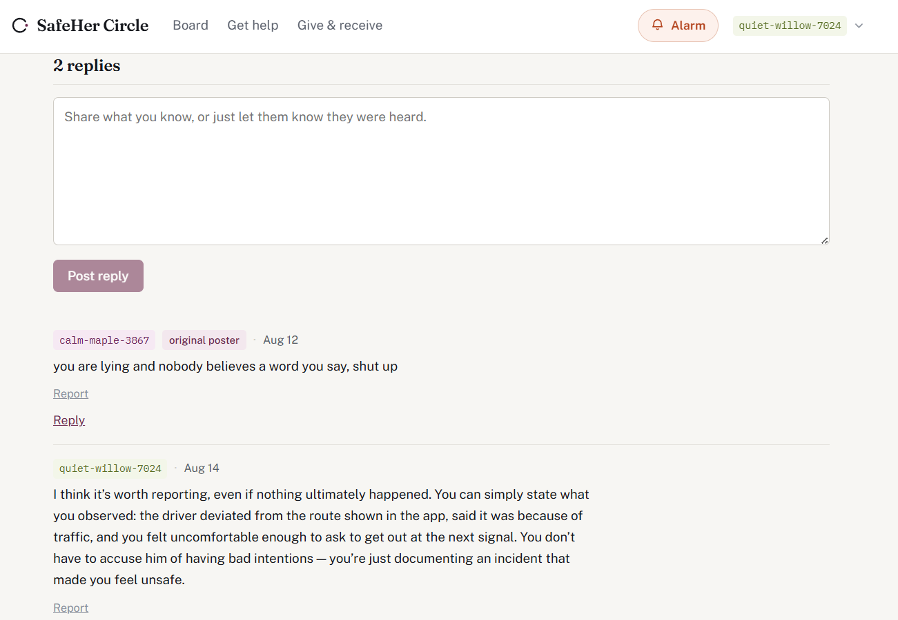 |

*Reading needs no account. The original poster is badged on her own replies.*

| The alarm | Where to get help |
|---|---|
| 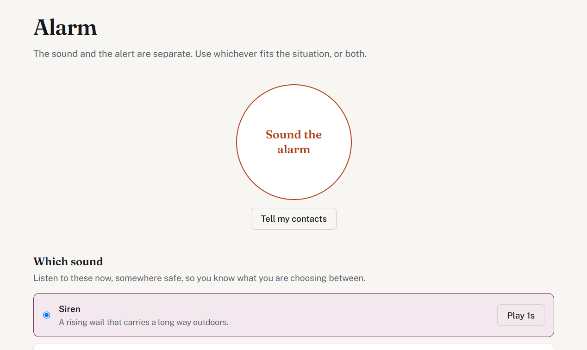 | 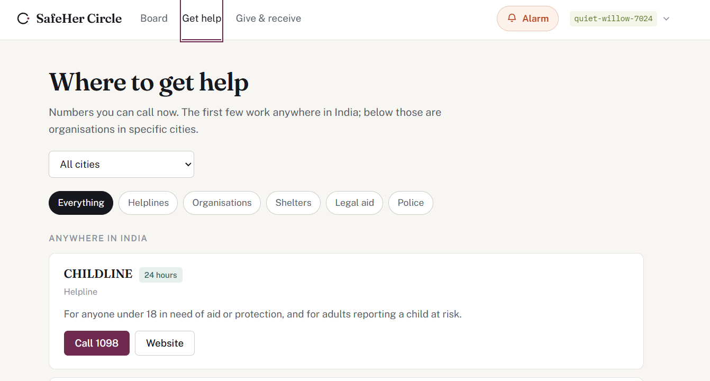 |

*The sound and the alert are separate controls. National numbers are pinned above city listings.*

| Give and receive | A completed exchange |
|---|---|
| 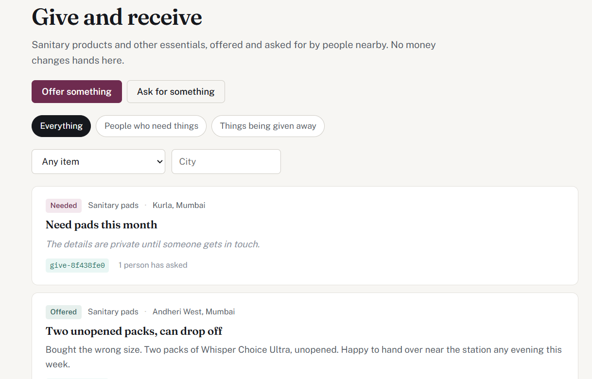 | 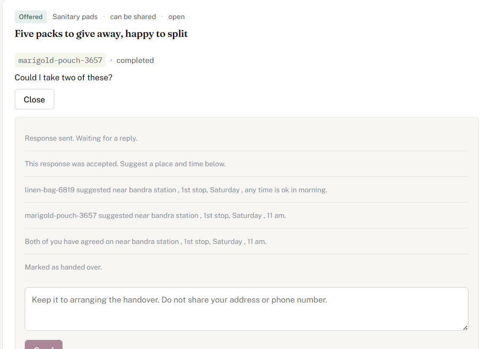 |

*The first listing has withheld its description. The thread carries the full system-message trail.*

| The moderation queue | Fake incoming call |
|---|---|
| 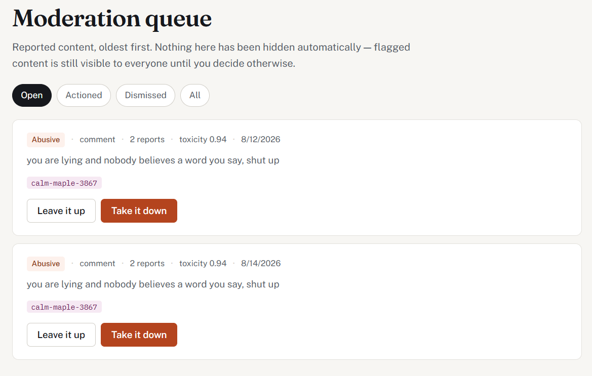 | 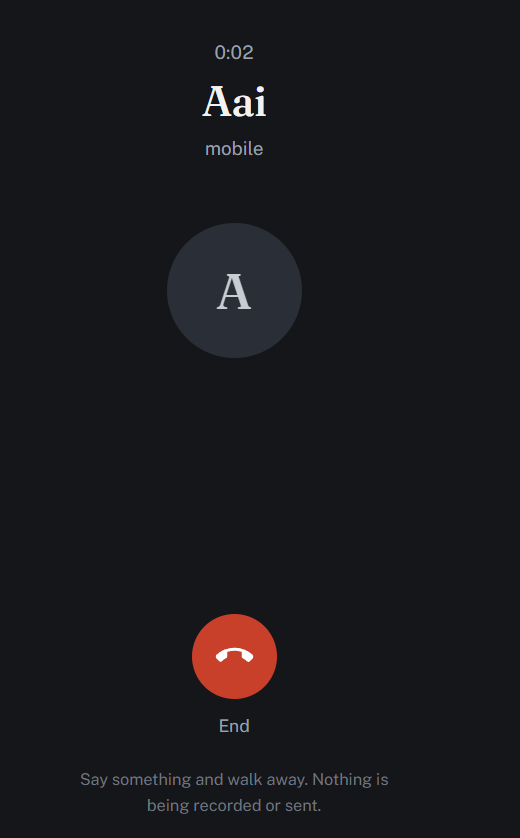 |

*The model score appears as a number, not a verdict. The call screen covers the entire viewport.*

---

## Architecture

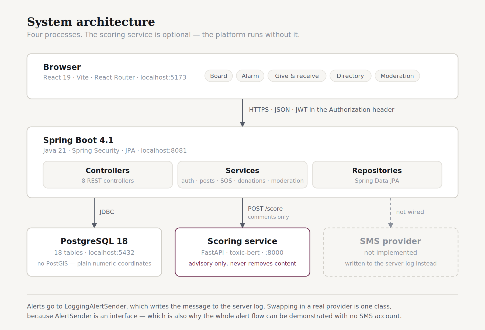

Four processes. The scoring service is optional — set
`safeher.scoring.enabled=false` and the platform runs without it. No SMS
provider is wired in; alerts are written to the server log by
`LoggingAlertSender`, and swapping in a real one is a single class because
`AlertSender` is an interface.

---

## How someone moves through it

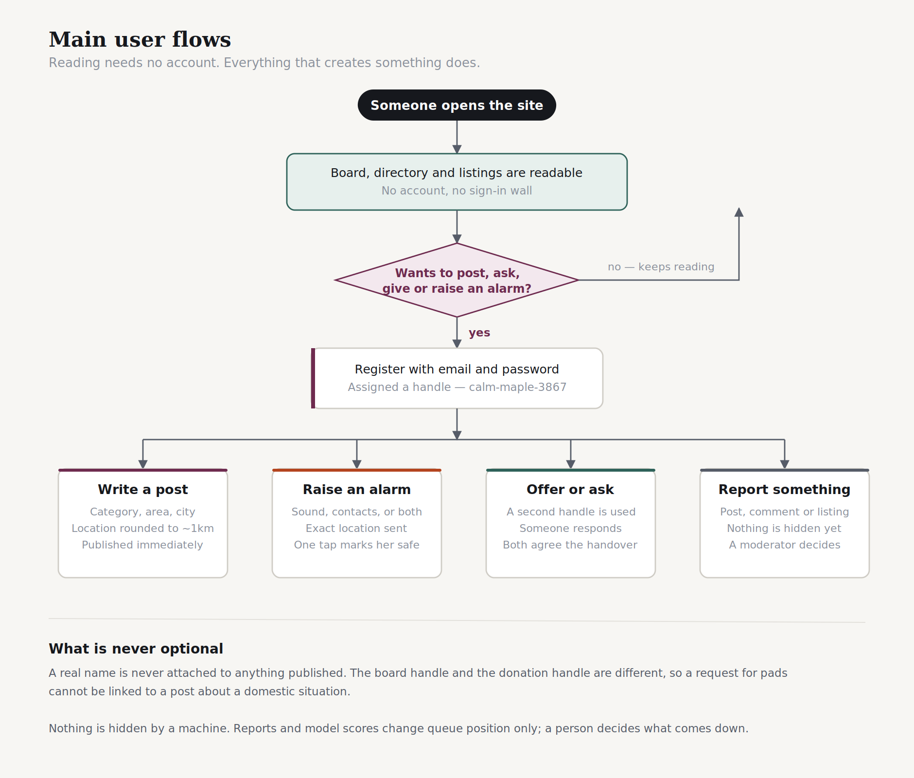

Reading the board, the directory and the listings needs no account. Everything
that creates something does — which is deliberate, because an anonymous board
with no accounts has no brake on mass false reporting or brigading.

---

## Methodology

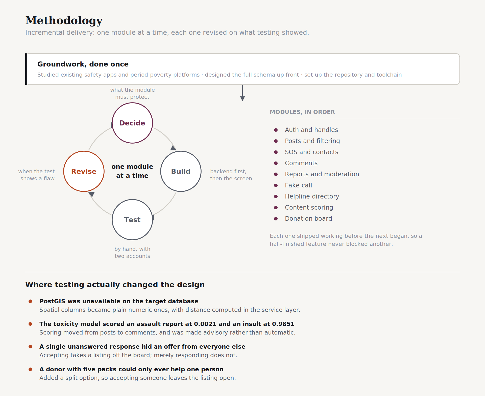

Nine modules, each shipped working before the next began. The interesting part
is the revise step: four times, testing showed the design was wrong and it
changed. Those four are listed in the diagram, and the second one is the
subject of its own section below.

---

## Features

### Anonymous board
Everyone writes under a generated handle like `calm-maple-3867`. Eight
categories, filtering by category, city or search, and replies threaded one
level deep. The original poster is badged on her own replies, so when someone
returns to say what worked, you can see it is her.

### Emergency alarm
Three sounds, generated in the browser with the Web Audio API rather than
loaded as files, so they work with no signal: a siren that carries outdoors, a
sharp pulse like a smoke alarm, and a low warble that travels through walls.

The sound and the alert are separate buttons. Someone in a stairwell may want
noise and nobody told; someone being followed quietly may want her sister to
know without a siren announcing it.

### Trusted contacts
Up to five people, contacted in priority order, with a map link to the exact
location. One tap marks her safe. Pressing the button repeatedly does not raise
five alerts — the live one is returned and its location updated.

### Fake incoming call
Schedules the phone to ring after a chosen delay, with a full-screen call
display and a generated ringtone. The point is an excuse to leave a
conversation without having to announce that you feel unsafe, which is often
the thing that escalates a situation. Nothing is sent anywhere and nothing is
recorded.

### Give and receive
A board for pads, sanitary products and other essentials. Post an offer or a
request, respond to someone else's, and arrange a handover in a private thread
— no phone numbers published. No money changes hands anywhere in this feature,
deliberately: the moment payments enter, so do fraud, KYC and payment
regulation.

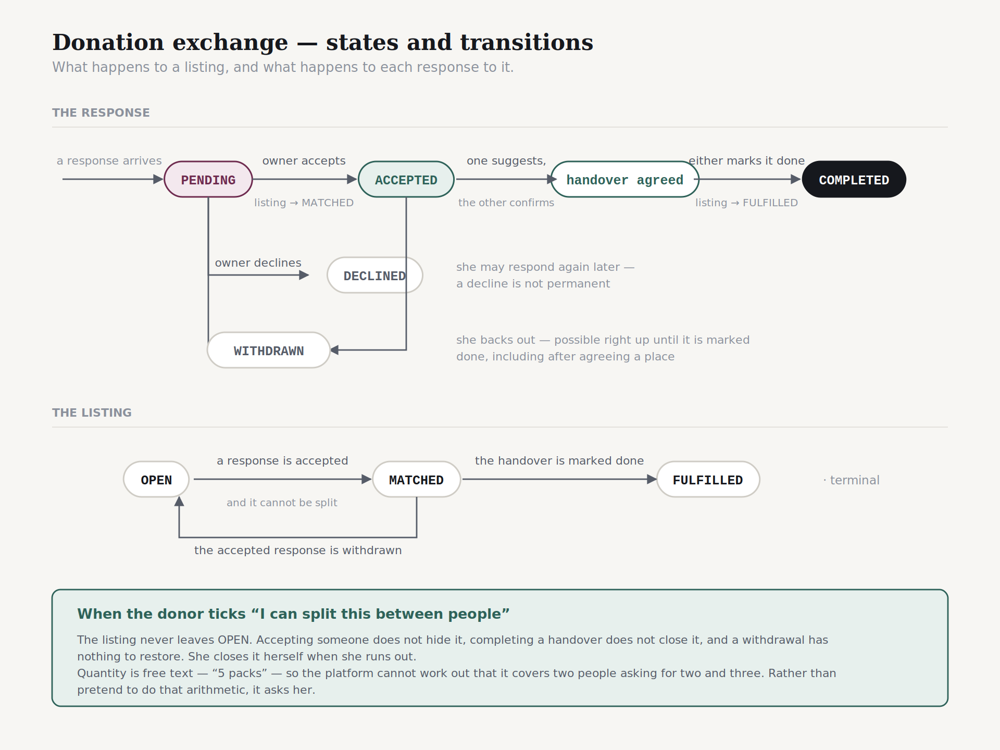

### Directory of help
Helplines, NGOs, shelters and legal aid, filtered by city. National numbers are
pinned to the top and never filtered out, because 112 works everywhere.

Every entry carries a verification status. Numbers checked against the National
Commission for Women's published list are marked verified; entries not
independently confirmed say so on the card. A wrong number here is worse than
an empty table — someone dials it, gets nothing, and loses time she may not
have.

### Reporting and moderation
Any post, comment or listing can be reported. Three separate reports mark
content as flagged, which raises it in the moderation queue and changes nothing
a reader sees. Content is hidden only when a moderator decides.

Moderators never see who reported something. On a board where women write about
abusive partners, "who reported me" is a question that gets people hurt.

---

## What we measured about the model

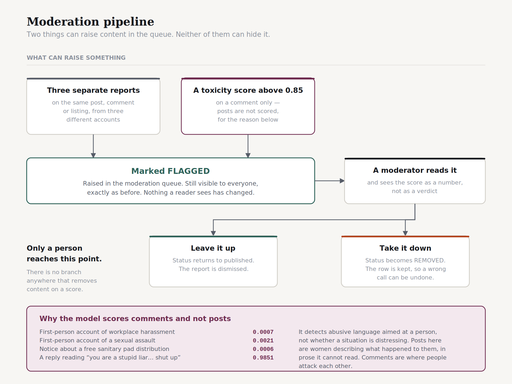

We tested `unitary/toxic-bert` against content representative of this platform
before deciding where to use it.

| Content | Toxicity | Model's suggestion |
|---|---|---|
| First-person account of workplace harassment | 0.0007 | NONE |
| First-person account of a sexual assault | 0.0021 | NONE |
| Notice about a free sanitary pad distribution | 0.0006 | NONE |
| A reply reading "you are a stupid liar... shut up" | 0.9851 | FLAG |

The model detects **abusive language directed at a person**. It has no notion of
whether a *situation* is distressing.

An account of a sexual assault and a notice about free pads differ by 0.0015 —
indistinguishable. Either differs from an insult by three orders of magnitude.

This is not a flaw in the model; it is doing exactly what it was trained to do.
But it means the obvious design — routing posts through a toxicity classifier to
surface people who need help — would surface nobody, while confidently policing
tone.

**What we did about it:**

- **Scoring runs on comments, not posts.** Posts here are women describing what
  happened to them, in measured prose the model cannot read. Comments are where
  people attack each other, which it reads accurately.
- **Nothing is hidden automatically.** A high score marks a comment flagged,
  which raises it in the moderation queue and changes nothing a reader sees.
- **The moderator sees the number, not a verdict.** The queue shows
  `toxicity 0.94` rather than "flagged by AI", so she judges the model rather
  than deferring to it.

---

## Privacy design

Five decisions worth knowing about.

**Two pseudonyms, one person.** Posts use one generated handle; the donation
board uses a different one from a different word list. "I cannot afford pads
this month" is a disclosure of poverty, and linking it to the handle that
writes about a domestic situation would let anyone assemble a profile of a
woman at her most vulnerable.

**Location is coarse on posts and exact on alerts.** A post's coordinates are
rounded to roughly a 1.1km square. An alert's are precise. Same app, opposite
defaults: for a post, precision endangers the author; for an alert, precision
is the entire point.

**Login errors are deliberately identical.** "No such account" and "wrong
password" return the same message, so the login form cannot be used to discover
which women have accounts here.

**A hidden description is never sent.** When a request withholds its detail, the
field is `null` in the API response rather than present and hidden by the
browser. A field the client is trusted not to render is a field that leaks.

**Handles are copied onto every post and listing.** So deleting an account
leaves the thread readable instead of gutting conversations other people took
part in.

---

## Tech stack

| Layer | Choice |
|---|---|
| Frontend | React 19 (Vite), React Router, plain CSS |
| Backend | Java 21, Spring Boot 4.1, Spring Security |
| Database | PostgreSQL 18 |
| Auth | JWT, bcrypt |
| Audio | Web Audio API — no audio files |
| Scoring service | Python, FastAPI, Hugging Face Transformers |

```
├── frontend/      React app
├── backend/       Spring Boot REST API
├── ml-service/    FastAPI content scoring
├── scripts/       Seed data
└── docs/          Schema, migrations, diagrams, demo video
```

---

## Running it locally

**Requirements:** Node 18+, Java 21, Maven, PostgreSQL 14+, Python 3.10+

```bash
git clone https://github.com/SHRAVANIMJ24/safeher-circle.git
cd safeher-circle
```

**Database** — run these in order, once each. None of them guard against a
second run.

```bash
createdb -U postgres safeher
psql -U postgres -d safeher -f docs/schema.sql
psql -U postgres -d safeher -f docs/donation-migration.sql
psql -U postgres -d safeher -f docs/handover-migration.sql
psql -U postgres -d safeher -f docs/partial-migration.sql
psql -U postgres -d safeher -f docs/directory-seed.sql
```

**Backend**

```bash
cd backend
cp src/main/resources/application-local.properties.example src/main/resources/application-local.properties
# fill in your database password and a JWT secret of 32+ characters
./mvnw spring-boot:run
```

**Frontend**

```bash
cd frontend
npm install
echo "VITE_API_URL=http://localhost:8081" > .env
npm run dev
```

**Scoring service** — optional. Set `safeher.scoring.enabled=false` in
`application.properties` to run without it.

```bash
cd ml-service
python -m venv venv
source venv/Scripts/activate     # or: source venv/bin/activate
pip install -r requirements.txt
uvicorn app.main:app --port 8000
```

The first run downloads about 400MB of model weights.

| Service | Port |
|---|---|
| Frontend | 5173 |
| Backend | 8081 |
| Scoring service | 8000 |

**Seed the board**

```bash
bash scripts/seed-posts.sh
```

**Make yourself a moderator** — there is no interface for this on purpose.

```bash
psql -U postgres -d safeher -c "UPDATE users SET role = 'ADMIN' WHERE email = 'your@email.com';"
```

Sign out and back in afterwards; the role is baked into the token.

For a full walkthrough with sample content, see
**[docs/demo-content.md](docs/demo-content.md)**.

---

## Limitations, stated rather than hidden

**Not deployed.** This runs locally. A hosted version would need the free-tier
tradeoffs to be honest about too — a cold-starting backend is disqualifying for
a panic button, and pretending otherwise would be worse than not deploying.

**No SMS is actually sent.** `LoggingAlertSender` writes the message to the
server log. Alerts reach nobody until a real provider is wired in.

**The model is trained on English.** Hinglish, Marathi and Devanagari score
unpredictably. On a platform aimed at Indian users this is a serious gap, not a
footnote.

**Category prediction is keyword matching, not machine learning.** A trained
classifier needs labelled posts from this platform, which do not exist yet.

**Most directory entries are unverified.** Only the national helplines have been
checked against a primary source. The interface says so on each card.

**Nobody on the donation board is verified.** Two strangers arranging to meet is
the riskiest thing this project does. The platform suggests public places in
daylight and says plainly that it cannot vouch for anyone — which is the honest
position, not a solved problem.

**This is a student project, not an emergency service.** In an emergency in
India, dial **112**.

---

## License

MIT
